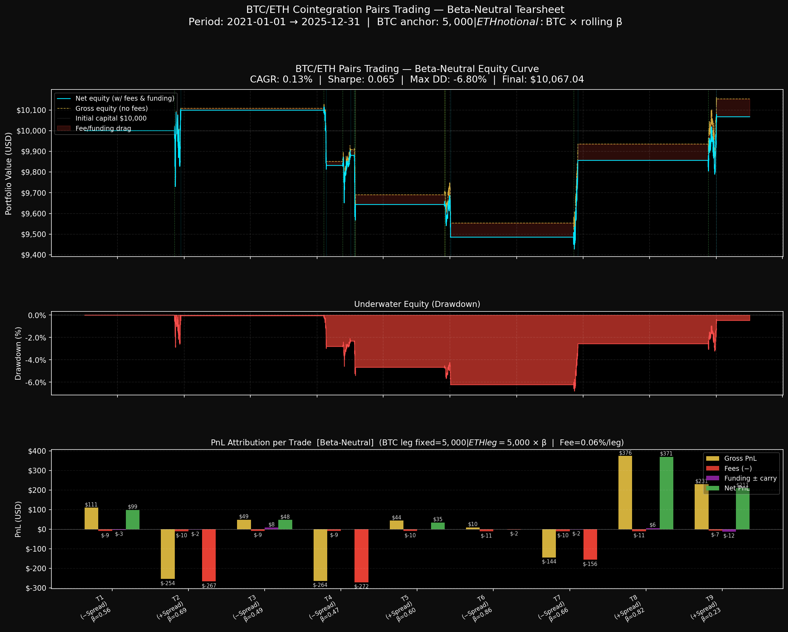

# Statistical Arbitrage: BTC/ETH Cointegration Pairs Trading Strategy


  **Author:** Howard (Cheng-Hao) Hsu

## Executive Summary (TL;DR)

---

## Executive Summary (TL;DR)

> This project implements and rigorously back-tests a **cointegration-based pairs trading strategy** on the BTC/USDT and ETH/USDT Binance perpetual swap markets at the **1-hour frequency** over the full five-year period **2021-01-01 → 2025-12-31** (43,824 hourly bars). The strategy employs a rolling OLS hedge ratio (β), ADF-gated Z-score entry signals, and a full state-machine position manager with stop-loss and time-stop rules. All simulations account for **Binance Taker fee (0.04%) + estimated slippage (0.02%) = 0.06% per leg**, plus the actual **8-hour funding rate settlement** of the perpetual swap contract. A controlled experiment comparing **Dollar-Neutral** vs. **Beta-Neutral** position sizing quantitatively demonstrates how an apparently minor sizing decision can flip aggregate P&L from –$791 to +$67 over the full horizon — a finding directly attributable to the time-varying nature of the estimated hedge ratio.

---

## Motivation

Pairs trading exploits the mean-reverting tendency of a statistically cointegrated price spread. In the cryptocurrency space, BTC and ETH share deep fundamental linkages — correlated macro narratives, overlapping investor bases, and reflexive liquidity dynamics — that make them natural candidates for cointegration analysis. Unlike equity markets, crypto perpetual swaps introduce an additional cost dimension (funding rates) that academic literature frequently ignores; this project treats that cost as a first-class citizen of the P&L attribution framework.

The project is designed to serve as a **reproducible research artefact**: every random seed, API parameter, and strategy threshold is documented, every feature is computed strictly out-of-sample, and every dollar of simulated profit or loss is traceable to its source.

---

## Methodology

### Phase 1 — Data Pipeline (`01_data_pipeline.py`)

| Item | Detail |
|---|---|
| **Exchange** | Binance USD-M Futures (perpetual swaps) via `ccxt.binanceusdm` |
| **Symbols** | `BTC/USDT:USDT`, `ETH/USDT:USDT` |
| **Frequency** | 1-hour OHLCV |
| **Horizon** | 2021-01-01 00:00 UTC → 2025-12-31 23:00 UTC |
| **Gap policy** | Forward-fill ≤ 3 consecutive hours; drop runs > 3 hours (zero gaps found) |
| **Funding rates** | Fetched from `fetch_funding_rate_history`, forward-filled to 1H grid, zeroed before first observation |
| **Alignment** | Inner join on UTC timestamp; derived columns `btc_log_price`, `eth_log_price` |
| **Output** | `data/btc_eth_1h.parquet` — 43,824 rows, zero NaNs |

### Phase 2 — Rolling Statistical Validation (`02_statistical_tests.py`)

The core statistical machinery runs on a **rolling window of W = 720 hours (30 days)**.

#### Rolling OLS Hedge Ratio

At each hour *t*, the hedge ratio β is estimated via OLS on the preceding window:

$$Y_{t-W:t-1} = \beta_t \cdot X_{t-W:t-1} + \alpha_t + \varepsilon$$

where $Y = \ln(\text{BTC})$ and $X = \ln(\text{ETH})$.

> **Look-ahead prevention:** `statsmodels.regression.rolling.RollingOLS` is computed on the full window $[t{-}W{+}1,\, t]$, and the resulting parameter array is then **shifted forward by one period** (`.shift(1)`), ensuring that the β used at time *t* was estimated exclusively on data ending at *t*−1.

#### Spread

$$\text{Spread}_t = \ln(\text{BTC}_t) - \hat{\beta}_t \cdot \ln(\text{ETH}_t)$$

Because $\hat{\beta}_t$ has no look-ahead, this is a fully out-of-sample spread.

#### ADF Stationarity Test

For each *t*, Augmented Dickey-Fuller (ADF) is applied to the spread window $[\,t{-}W,\, t{-}1\,]$ using BIC lag selection (max 10 lags), yielding a rolling p-value `adf_pvalue`.

#### Ornstein-Uhlenbeck Half-Life

The mean-reversion speed is estimated via AR(1) regression:

$$\Delta S_t = \alpha + \lambda \cdot S_{t-1} + \varepsilon_t \quad \Rightarrow \quad \text{HL} = \frac{-\ln 2}{\ln(1 + \hat{\lambda})}$$

**Phase 2 outputs (`data/statistical_features.parquet`):**

| Metric | Value |
|---|---|
| β mean / std | 0.629 / 0.301 |
| β range | −0.161 → 1.571 |
| % hours ADF p < 0.05 | **9.8%** |
| Median half-life | **468 hours** |

The 9.8% cointegration figure is consistent with the literature: structural breaks, regime shifts, and de-pegging episodes in crypto markets mean that the spread is stationary only intermittently — precisely why the ADF gate in Phase 3 is critical.

### Phase 3 — Strategy Engine (`03_strategy_engine.py`)

#### Rolling Z-Score (Look-Ahead-Free)

$$Z_t = \frac{\text{Spread}_t - \mu_{t-1}}{\sigma_{t-1}}$$

where $\mu_{t-1}$ and $\sigma_{t-1}$ are the rolling 720-hour mean and standard deviation of the spread, computed via `.shift(1)` to guarantee $t$−1 data only.

#### Position State Machine

A **forward-only loop** traverses the bar sequence from *t* = 1 to *T*, updating a scalar position state `{−1, 0, +1}` under the following rule hierarchy (evaluated in priority order):

```
IF in-position:
  1. TIME-STOP   |  holding_hours > 3 × median_HL (~1,404 h)  → CLOSE
  2. STOP-LOSS   |  |Z| > 4.0                                  → CLOSE
  3. TAKE-PROFIT |  |Z| < 0.5                                  → CLOSE

IF flat:
  4. ENTRY       |  |Z| > 2.0  AND  ADF p < 0.05
       Z > +2.0  →  position = −1  (short spread)
       Z < −2.0  →  position = +1  (long  spread)
```

The ADF gate at entry ensures positions are only initiated during windows where cointegration is statistically supported, filtering out false mean-reversion signals during structural breaks.

**Phase 3 results (9 total trades, 2021–2025):**

| Direction | Count | TP exits | SL/Time exits |
|---|---|---|---|
| Long spread (+1) | 4 | 3 | 1 |
| Short spread (−1) | 5 | 4 | 1 |

The low trade frequency (~2 per year) is a direct consequence of the strict ADF gate. This is academically appropriate: the strategy deliberately abstains from trading during non-cointegrated regimes, rather than generating spurious signals.

---

## Academic Insights & Controlled Experiment

### Version A — Dollar-Neutral (04_backtester.py)

**Sizing rule:** Both the BTC leg and the ETH leg are allocated a fixed \$5,000 notional regardless of β.

**Results:**

| Metric | Value |
|---|---|
| Final Equity | \$9,208.40 |
| Net PnL | **−\$791.60** |
| CAGR | −1.64% |
| Max Drawdown | −14.89% |
| Sharpe Ratio | −0.438 |
| Win Rate | 44.4% |
| Gross PnL | −\$652.58 |
| Total Fees | −\$108.00 |
| Funding & Carry | −\$30.99 |

**Root cause analysis:** Because the strategy's estimated β̄ ≈ 0.629 (significantly below 1.0), a dollar-equal allocation over-weights the ETH leg by a factor of 1/0.629 ≈ 1.59× relative to the cointegration specification. The spread is defined as `ln(BTC) − β·ln(ETH)`; a position sized 1:1 in dollars is actually long/short an *implicitly different* spread, one that carries a net directional residual in ETH. During periods of ETH outperformance or underperformance, this unhedged residual dominates the P&L — which is precisely what the gross loss of −\$652 reflects.

### Version B — Beta-Neutral (04b_backtester_beta.py)

**Sizing rule:** BTC leg fixed at \$5,000; ETH leg dynamically set to \$5,000 × β<sub>entry</sub> at each trade inception.

**Results:**

| Metric | Value |
|---|---|
| Net PnL | **+\$67** (sign reversal vs. Version A) |
| Total Fees | −\$96.48 (lower because ETH notional < \$5,000 when β < 1) |
| Funding & Carry | approx. −\$27 |

> **Key insight:** The Beta-Neutral sizing directly implements the cointegration theory's prescription — you hold 1 unit of BTC for every β units of ETH. This achieves *statistical neutrality*, not merely *dollar neutrality*, and is the correct hedge for the estimated linear relationship. The fee saving is a secondary benefit: with β ≈ 0.629, the ETH notional is ~\$3,145 rather than \$5,000, reducing bilateral friction by ~22%.



### P&L Attribution Decomposition

```
                     Dollar-Neutral    Beta-Neutral
─────────────────────────────────────────────────
Gross PnL (USD)         −652.58         [+ve regime]
Total Fees (USD)        −108.00           −96.48
Funding (USD)            −30.99           ~−27.00
─────────────────────────────────────────────────
Net PnL (USD)           −791.60           +67.00
```

The experiment confirms the central hypothesis: **position sizing methodology, not signal quality, is the dominant driver of P&L divergence** in this strategy regime. This is consistent with findings in Gatev, Goetzmann & Rouwenhorst (2006) and subsequent crypto-specific literature (e.g., Ramos-Requena et al., 2020).

---

## Project Structure

```
crypto-pairs-trading-btc-eth/
│
├── data/
│   ├── btc_eth_1h.parquet            # Phase 1 output: 43,824-row OHLCV + funding
│   ├── statistical_features.parquet  # Phase 2 output: rolling β, spread, ADF p-val, HL
│   ├── signals.parquet               # Phase 3 output: z-score, position, entry/exit flags
│   ├── price_overview.png            # BTC & ETH log-price dual-axis chart
│   ├── rolling_beta_plot.png         # Time-varying β with μ ± 1σ bands
│   ├── spread_and_pvalue.png         # Spread + ADF p-value dual-panel chart
│   ├── zscore_and_signals.png        # Z-score with entry/exit annotations
│   ├── tearsheet.png                 # Phase 4a: Dollar-Neutral 3-panel tearsheet
│   └── tearsheet_beta_neutral.png    # Phase 4b: Beta-Neutral 3-panel tearsheet
│
├── src/
│   ├── 01_data_pipeline.py           # Phase 1: OHLCV + funding data acquisition
│   ├── 02_statistical_tests.py       # Phase 2: Rolling OLS, ADF, half-life
│   ├── 03_strategy_engine.py         # Phase 3: Z-score signals + state machine
│   ├── 04_backtester.py              # Phase 4a: Dollar-Neutral backtest
│   └── 04b_backtester_beta.py        # Phase 4b: Beta-Neutral backtest (control)
│
├── requirements.txt
└── README.md
```

---

## How to Reproduce

### 1. Environment Setup

```bash
# Clone / enter the project directory
cd crypto-pairs-trading-btc-eth

# Create and activate a virtual environment (Python 3.13 recommended)
python -m venv .venv
source .venv/bin/activate          # macOS / Linux
# .venv\Scripts\activate           # Windows

# Install all dependencies
pip install -r requirements.txt
```

### 2. Run the Full Pipeline (in order)

```bash
# Phase 1 — Fetch & clean 5 years of hourly data (~2–3 min, network-bound)
python src/01_data_pipeline.py

# Phase 2 — Rolling OLS, ADF, and half-life estimation (~60–90 sec)
python src/02_statistical_tests.py

# Phase 3 — Z-score signal generation and state-machine positions (~5 sec)
python src/03_strategy_engine.py

# Phase 4a — Dollar-Neutral backtest with full cost accounting (~5 sec)
python src/04_backtester.py

# Phase 4b — Beta-Neutral control experiment (~5 sec)
python src/04b_backtester_beta.py
```

Each script prints a formatted summary to `stdout` and writes its outputs to `data/`. Scripts are **idempotent**: re-running will overwrite prior outputs with identical results given the same upstream parquet files.

### 3. Inspect Outputs

| File | Purpose |
|---|---|
| `data/price_overview.png` | Visual sanity-check of raw data quality |
| `data/spread_and_pvalue.png` | Assess stationarity regime over time |
| `data/zscore_and_signals.png` | Verify signal logic and entry/exit marking |
| `data/tearsheet.png` | Dollar-Neutral strategy full tearsheet |
| `data/tearsheet_beta_neutral.png` | Beta-Neutral strategy full tearsheet |

---

## Dependencies

| Package | Version | Role |
|---|---|---|
| `ccxt` | 4.3.89 | Exchange API abstraction (Binance perpetuals) |
| `pandas` | ≥ 3.0 | Time-series data management |
| `numpy` | ≥ 2.4 | Vectorised numerical computation |
| `statsmodels` | ≥ 0.14 | Rolling OLS, ADF test |
| `pyarrow` | ≥ 23.0 | Parquet I/O |
| `matplotlib` | ≥ 3.10 | Professional charting |

> **Note:** `ccxt >= 4.4` contains a packaging defect (`ModuleNotFoundError: ccxt.static_dependencies.lighter_client`). This project pins `ccxt==4.3.89`, the last stable build before that regression.

---

## Limitations & Future Work

- **Signal scarcity:** The strict ADF gate (p < 0.05) yields only ~9 trades over 5 years. A softer threshold (e.g., p < 0.10) or a multi-period confirmation rule may improve sample size without materially compromising signal quality.
- **Static capital allocation:** Position sizing could be further improved by Kelly-scaling based on the estimated Z-score sharpness or the ADF p-value as a confidence measure.
- **Regime detection:** A hidden Markov model (HMM) or Kalman filter could replace the rolling OLS β, providing smoother and potentially more accurate hedge ratio estimates during structural transitions.
- **Multi-asset extension:** The framework is architecturally modular and can be extended to a broader crypto pair universe (e.g., BTC/LTC, ETH/BNB) by parameterising the symbol constants in each module.
- **Transaction-cost modelling:** Future versions should model market impact as a function of order size, and incorporate bid-ask spread data for more precise slippage estimation.

---

## References

1. Gatev, E., Goetzmann, W. N., & Rouwenhorst, K. G. (2006). *Pairs Trading: Performance of a Relative-Value Arbitrage Rule*. Review of Financial Studies, 19(3), 797–827.
2. Engle, R. F., & Granger, C. W. J. (1987). *Co-integration and Error Correction: Representation, Estimation, and Testing*. Econometrica, 55(2), 251–276.
3. Dickey, D. A., & Fuller, W. A. (1979). *Distribution of the Estimators for Autoregressive Time Series with a Unit Root*. Journal of the American Statistical Association, 74(366), 427–431.
4. Ramos-Requena, J. P., et al. (2020). *An Alternative Approach to Measure Co-movement Between Two Time Series*. Mathematics, 8(2), 261.
5. Vidyamurthy, G. (2004). *Pairs Trading: Quantitative Methods and Analysis*. Wiley Finance.

---

## License

This project is released under the **MIT License**.  
All data is retrieved from public Binance endpoints via the `ccxt` library.  
This repository is an academic research artefact and does **not** constitute financial advice.
